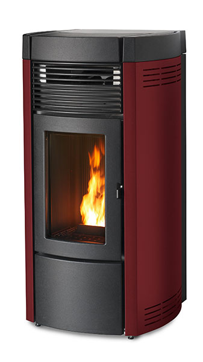

# MCZ Musa Python Controller

This program allows controlling remotely your **MCZ Musa** pellet stove and retrieve its status. MCZ Musa Python Controller uses a MQTT broker to receive JSON commands, convert and send them to the MCZ Musa through a Web Socket connection.

<div style="text-align:center;"></div>

It has been tested on MCZ Musa Suite Comfort Air 12 M1 on a [Raspberry Pi Zero W](https://www.raspberrypi.org/products/raspberry-pi-zero-w/). Basic commands should be compatible with all [Maestro powered stoves](https://www.mcz.it/en/maestro-technology/).


## Installation

To run MCZ Musa Python Controller your smart home gateway device connection must be bridged between the stove internal Wi-Fi and your local network. It can be achieved easily with a Raspberry Pi device and, if an Ethernet port is not available, a (Micro) USB-Ethernet adapter.

The first step is installing a MQTT message broker, for example [Mosquitto](https://mosquitto.org/download/).

```bash
sudo apt update
sudo apt install -y mosquitto mosquitto-clients
sudo systemctl enable mosquitto.service
```

Install, then, `python3.7+` dependencies with

```bash
sudo apt install python3-pip
pip3 install -r requirements.txt
```

After connecting to the stove's Wi-Fi, run

```
python3 musa
```

Or run `sudo bash install.sh`


### Containerization

An alternative to MCZ Musa Python Controller installation is its `docker` containerization, with lightweight Alpine images. It requires the installation of [docker](https://docs.docker.com/install/) and [docker-compose](https://docs.docker.com/compose/install/). For Raspberry PI see [Raspberry PI Docker Installation Guide](https://dev.to/rohansawant/installing-docker-and-docker-compose-on-the-raspberry-pi-in-5-simple-steps-3mgl).


After the installation and the connection of your device with the stove's Wi-Fi, simply run the MQTT broker and the Python Controller with

```bash
# download eclipse-mosquitto base image
docker pull eclipse-mosquitto
# build the MCZ Musa Python Controller image
docker-compose build
# run the container (detached)
docker-compose up -d
```

and stop it with

```bash
# stop the container
docker-compose down
```


## Examples

To send commands to the stove see:

- `examples/publish.py`: message pubblication examples;
- `musa/src/commands.py`: list of all known commands.

To retrieve the stove's infomation, see `examples/read.py`. See also `musa/src/cfg.py` for the configuration parameters.


### Integration with existing apps

**Sending messages**: your app should be able to publish messages on `/mcz/in` MQTT channel.

**Receiving results**: listen to `/mcz/out` MQTT channer or eventually, change the `musa/src/ws.py` function `on_message` to send Web Socket parsed messages directly to your app.


## Credits

[Chibald maestrogateway](https://github.com/Chibald/maestrogateway) and [Anthony-55](https://github.com/Anthony-55/maestro)


## Diclaimer

**If** anyone will ever use this code, I do not take any responsability. Do not play with fire.


## License

This project is licensed under the WTFPL License.
